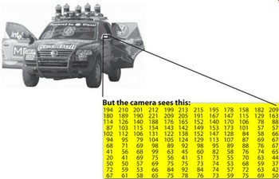
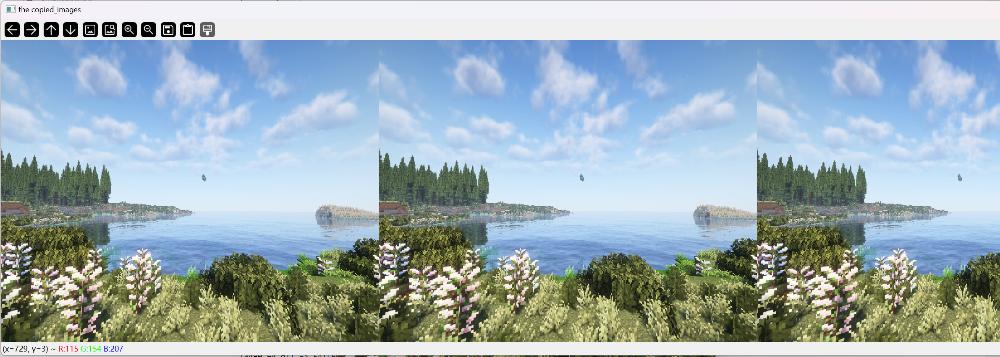
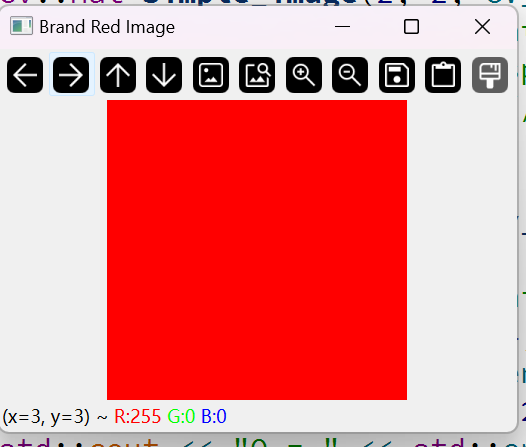

# cv::Mat的使用

​	尽管我们完全可以把cv::Mat当作一个黑盒，但是笔者的建议是仍然要深入理解和学习cv::Mat自身的构造逻辑和存储原理，这样在查找问题，或者是遇到一些奇奇怪怪的图像显示问题的时候能够快速的想到问题的跟源。这是笔者打算从这里开始的一个重要的目的

​	在实际上，我们有多种方法从现实世界获取数字图像：数码相机、扫描仪、计算机断层扫描和磁共振成像等。当然，对于每一个初学者，更多可能是从我们的摄像头开始的。在每种情况下，我们（人类）看到的都是图像。但是，当将其转换为我们的数字设备时，我们记录的是图像每个点的数值。也就是说，我们使用数值来存储记录图像的信息。然后真正显示的时候控制设备按照我们存储的信息还原出来。就是这样的，比如说下面这种



（这个图太经典了，任何一个阅读过《学习Opencv3》的朋友都会知道这张图片），我们人眼看到的是一个车子，但是对于计算机而言，只不过是一个包含像素点所有强度值的矩阵。我们获取和存储像素值的方式可能因我们的需求而异，但最终计算机世界中的所有图像都可以简化为数值矩阵和描述矩阵本身的其他信息。OpenCV 是一个计算机视觉库，其主要重点是处理和操纵这些信息。因此，您需要熟悉的第一件事是 OpenCV 如何存储和处理图像。

### Mat

​	OpenCV 自 2001 年以来一直存在。当时，该库是围绕 C 接口构建的，为了将图像存储在内存中，他们使用了一个名为 IplImage 的 C 结构。这是您在大多数旧教程和教育材料中都会看到的。**问题在于，它把 C 语言的所有缺点都带到了桌面上。最大的问题是手动内存管理。它建立在用户负责处理内存分配和释放的假设之上。**虽然这对于较小的程序来说不是问题，但一旦您的代码库增长，处理所有这些问题就会更加困难，而不是专注于解决您的开发目标。

​	幸运的是，C++ 出现了，并引入了类的概念，通过自动内存管理（或多或少）让用户更容易使用。好消息是 C++ 与 C 完全兼容，因此进行更改不会出现兼容性问题。因此，OpenCV 2.0 引入了一个新的 C++ 接口，提供了一种新的方式，这意味着您不需要摆弄内存管理，从而使您的代码更简洁（编写更少，实现更多）。 C++ 接口的主要缺点是，目前许多嵌入式开发系统仅支持 C。因此，除非您针对的是嵌入式平台，否则使用旧方法是没有意义的（除非您是受虐狂程序员，而且您在自找麻烦）。

​	关于 Mat，您需要知道的第一件事是，**您不再需要手动分配内存并在不需要时立即释放它。虽然这样做仍然是可能的，但大多数 OpenCV 函数都会自动分配其输出数据。如果您传递已经为矩阵分配所需空间的现有 Mat 对象，这将被重用，**这是一个不错的奖励。换句话说，我们始终只使用执行任务所需的内存。

​	Mat 基本上是一个包含两个数据部分的类：**矩阵头（包含矩阵大小、用于存储的方法、矩阵存储在哪个地址等信息）和指向包含像素值的矩阵的指针（根据选择的存储方法采用任何维度）**。矩阵头大小是恒定的，但是矩阵本身的大小可能因图像而异，并且通常大几个数量级。

​	我们知道，OpenCV 是一个图像处理库。它包含大量图像处理函数。为了解决计算难题，大多数时候您最终会使用库中的多个函数。因此，将图像传递给函数是一种常见的做法。我们不应忘记，我们正在讨论图像处理算法，这些算法往往计算量很大。我们最不想做的事情是通过对可能很大的图像进行不必要的复制来进一步降低程序的速度。

​	为了解决这个问题，OpenCV 使用引用计数系统。这个想法是每个 Mat 对象都有自己的头，但是可以通过让它们的矩阵指针指向同一地址来在两个 Mat 对象之间共享矩阵。此外，复制运算符只会复制头和指向大矩阵的指针，而不是数据本身。

​	我们可以具备尝试性质的测试一下。比如说：

```
Mat A, C; // 仅创建头部分
A = imread(argv[1], IMREAD_COLOR); // 在这里我们将知道使用的方法（分配矩阵）
Mat B(A); // 使用复制构造函数
C = A; // 赋值运算符
```

​	所有上述对象最终都指向同一个数据矩阵，使用其中任何一个进行修改也会影响所有其他对象。实际上，不同的对象只是为相同的底层数据提供不同的访问方法。然而，它们的标题部分是不同的。现在您可能会问 - 如果矩阵本身可能属于多个 Mat 对象，那么当不再需要它时，谁负责清理它？简短的回答是：最后一个使用它的对象。这是通过使用引用计数机制来处理的。每当有人复制 Mat 对象的标题时，矩阵的计数器就会增加。每当清理标题时，此计数器就会减少。当计数器达到零时，矩阵将被释放。有时您也希望复制矩阵本身，因此 OpenCV 提供了 cv::Mat::clone() 和 cv::Mat::copyTo() 函数。

​	笔者在develop_example/examples/basic_usage示例子程序中书写了验证程序，看官可以移步查看。这是显示的效果：



​	（哦，实在是太长了）

​	值得一提的是，如果我们想要完全拷贝一个矩阵的时候：

```
Mat F = A.clone();
Mat G;
A.copyTo(G);
```

​	现在修改 F 或 G 不会影响 A 的标头指向的矩阵。您需要记住的是：

- OpenCV 函数的输出图像分配是自动的（除非另有说明）。
- 您无需考虑使用 OpenCV 的 C++ 接口进行内存管理。
- 赋值运算符和复制构造函数仅复制标头。
- 可以使用 cv::Mat::clone() 和 cv::Mat::copyTo() 函数复制图像的底层矩阵。

​	真正有趣的部分是，您可以创建仅引用完整数据的一部分的标题。例如，要在图像中创建感兴趣的区域 (ROI)，只需创建一个新的头部：

```
Mat D (A, Rect(10, 10, 100, 100) ); // 使用矩形
Mat E = A(Range::all(), Range(1,3)); // 使用行和列边界
```

### 存储方法

这是关于如何存储像素值。您可以选择颜色空间和使用的数据类型。颜色空间是指我们如何组合颜色成分以编码给定的颜色。最简单的是灰度，其中我们可以处理的颜色是黑色和白色。这些组合使我们能够创建多种灰色阴影。

对于丰富多彩的方式，我们有更多的方法可供选择。它们中的每一个都将其分解为三个或四个基本组件，我们可以使用这些组合来创建其他组件。最流行的是 RGB，主要是因为这也是我们的眼睛构建颜色的方式。它的基本颜色是红色、绿色和蓝色。为了对颜色的透明度进行编码，有时会添加第四个元素 alpha (A)。

但是，还有许多其他颜色系统，每个都有自己的优势：

- RGB 是最常见的，因为我们的眼睛使用类似的东西，但请记住，OpenCV 标准显示系统使用 BGR 颜色空间（红色和蓝色通道交换位置）组成颜色。
- HSV 和 HLS 将颜色分解为色调、饱和度和值/亮度分量，这是我们描述颜色的更自然的方式。例如，您可能会忽略最后一个组件，从而使您的算法对输入图像的光照条件不太敏感。
- YCrCb 是流行的 JPEG 图像格式。
- CIE L\*a\*b* 是一个感知均匀的颜色空间，如果您需要测量给定颜色与另一种颜色的距离，它会派上用场。

​	每个构建组件都有自己的有效域。这导致了所使用的数据类型。我们如何存储组件定义了我们对其域的控制。最小的数据类型是 char，这意味着一个字节或 8 位。这可能是无符号的（因此可以存储从 0 到 255 的值）或有符号的（从 -127 到 +127 的值）。虽然在三个组件（如 RGB）的情况下，这个宽度已经提供了 1600 万种可能的颜色来表示，但我们可以通过对每个组件使用浮点（4 字节 = 32 位）或双精度（8 字节 = 64 位）数据类型来获得更精细的控制。不过，请记住，增加组件的大小也会增加内存中整个图片的大小。

​	关于这些内容，笔者后面会进行更加详细的介绍。

## 创建一个指定像素方式的图像。

​	你已经学会了如何使用 cv::imwrite() 函数将矩阵写入图像文件。（没有？你跳过了0.beginners的篇章，去看看吧）但是，出于调试目的，查看实际值会更方便。**你可以使用 Mat 的 << 运算符来执行此操作**。请注意，这仅适用于二维矩阵。 虽然 Mat 作为图像容器确实很有效，但它也是一个通用矩阵类。因此，可以创建和操作多维矩阵。你可以用多种方式创建 Mat 对象：对于二维和多通道图像，我们首先定义它们的大小：按行数和列数。然后，我们需要指定用于存储元素的数据类型和每个矩阵点的通道数。为此，我们根据以下约定构建了多个定义：

```
CV_[每项的位数][有符号或无符号][类型前缀]C[通道号]
```

​	例如，CV_8UC3 表示我们使用 8 位长的无符号字符类型，每个像素有三个这样的类型来形成三个通道。最多有四个通道的预定义类型。cv::Scalar 是四个元素的短向量。指定它，您可以使用自定义值初始化所有矩阵点。这样，你可以猜猜我们的灰度图是如何表达的呢？CV_8UC1!可以回去翻翻你数字图像处理的书！0~255，手指头一算一个字节就能表达！

```
    std::cout << "Creating a image of 2 x 2 (0, 0, 255) Image";
    cv::Mat simple_image(2, 2, CV_8UC3, cv::Scalar(0, 0, 255));
    std::cout << "Opencv Implement the override function of the "
              << "ofstream to display the cv::Mat\n";
    std::cout << simple_image;  // will not be an error!
```

​	就是这样，我们创建了一个简单的，纯红色的图像（永远注意我们亲爱的Opencv使用的是BGR顺序来描述我们的图像！），你可以把行列拉大一些显示出来！



​	笔者的显示如上所示。各位看官可以看着玩！更改一下Scalar的值。

​	你还可以使用 C/C++ 数组并通过构造函数初始化

```
int sz[3] = {2,2,2};
Mat L(3,sz, CV_8UC(1), Scalar::all(0));
```

​	上例展示了如何创建一个多维矩阵。指定其维度，然后传递一个包含每个维度大小的指针，其余保持不变。

​	甚至可以是cv::Mat::create 函数：

```
M.create(4,4, CV_8UC(2));
cout << "M = "<< endl << " " << M << endl << endl;
```

​	另外，下面的这些内容属于想到了查函数的事情。笔者建议走马观花即可

​	Mat可以像使用Matlab函数那样的初始化方式

```
    std::cout << "Also, we can initalize the Mat as Matlab way";
    cv::Mat E = cv::Mat::eye(4, 4, CV_64F);
    std::cout << "E = " << std::endl << " " << E << std::endl << std::endl;
    cv::Mat O = cv::Mat::ones(2, 2, CV_32F);
    std::cout << "O = " << std::endl << " " << O << std::endl << std::endl;
    cv::Mat Z = cv::Mat::zeros(3, 3, CV_8UC1);
    std::cout << "Z = " << std::endl << " " << Z << std::endl << std::endl;
```

​	opencv自己还提供了其他的数据类型，比如说Point2D, Point3D。好消息是他们都实现了各自的打印函数。

```
    cv::Point2f     pt(0, 0);
    cv::Point3f     pt3(0, 0, 0);
    cv::Size        sz(10, 10);
    cv::Rect        rect(0, 0, 100, 100);
    cv::Scalar      color(255, 0, 0);
    cv::Range       range(0, 10);
    cv::Vec<int, 3> vec(0, 0, 0);
    cv::Vec3b       vec3b(0, 0, 0);
    cv::Vec3f       vec3f(0, 0, 0);
    cv::Vec3d       vec3d(0, 0, 0);

    // you can display them
    std::cout << "pt = " << pt << std::endl;
    std::cout << "pt3 = " << pt3 << std::endl;
    std::cout << "sz = " << sz << std::endl;
    std::cout << "rect = " << rect << std::endl;
    std::cout << "color = " << color << std::endl;
    std::cout << "range = " << range << std::endl;
    std::cout << "vec = " << vec << std::endl;
    std::cout << "vec3b = " << vec3b << std::endl;
    std::cout << "vec3f = " << vec3f << std::endl;
    std::cout << "vec3d = " << vec3d << std::endl;
```

​	当然，你可以参考

```
opencv/samples/cpp/tutorial_code/core/mat_the_basic_image_container/mat_the_basic_image_container.cpp
```

​	来进一步学习。