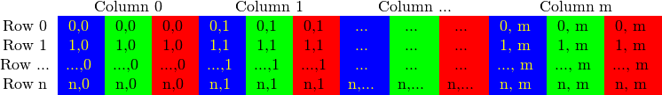

# 如何使用 OpenCV 扫描图像、查找表和时间测量

​	**让我们考虑一种简单的色彩缩减方法。通过使用无符号字符 C 和 C++ 类型来存储矩阵项，一个像素通道最多可以有 256 个不同的值。对于三通道图像，这可以形成太多颜色（确切地说是 1600 万种）。**使用如此多的色调可能会严重影响我们的算法性能。但是，有时使用更少的颜色就足以获得相同的最终结果。

​	在这种情况下，我们通常会进行色彩空间缩减。这意味着我们将色彩空间当前值除以新的输入值，以得到更少的颜色。例如，0 到 9 之间的每个值都取新值 0，10 到 19 之间的每个值都取新值 10，依此类推。

​	当您将 uchar（无符号字符 - 即 0 到 255 之间的值）值除以 int 值时，结果也将是 char。这些值只能是 char 值。因此，任何分数都会向下舍入。利用这一事实，uchar 域中的上层操作可以表示为：
$$
I_{new} = (I_{odd}/10)*10
$$
​	一个简单的色彩空间缩减算法只需遍历图像矩阵的每个像素并应用此公式即可。值得注意的是，**我们执行了除法和乘法运算。这些操作对于系统来说非常昂贵。如果可能的话，值得通过使用更便宜的操作（例如一些减法、加法或在最好的情况下进行简单的赋值）来避免它们。此外，请注意，我们只有有限数量的输入值用于上层操作。对于 uchar 系统，确切地说是 256。**

因此，对于较大的图像，最好事先计算所有可能的值，并在赋值期间使用查找表进行赋值。查找表是简单的数组（具有一个或多个维度），对于给定的输入值变化，它保存最终的输出值。它的优势在于我们不需要进行计算，我们只需要读取结果。

我们的测试用例程序（以及下面的代码示例）将执行以下操作：读取作为命令行参数传递的图像（可以是彩色或灰度图像），并使用给定的命令行参数整数值应用缩减。在 OpenCV 中，目前有三种主要方法可以逐像素地扫描图像。

- C 数组下表访问办法
- 迭代器
- 随即地址访问

​	下面我们来试试。笔者参考了opencv的示例代码[opencv/samples/cpp/tutorial_code/core/how_to_scan_images/how_to_scan_images.cpp at 4.x · opencv/opencv (github.com)](https://github.com/opencv/opencv/blob/4.x/samples/cpp/tutorial_code/core/how_to_scan_images/how_to_scan_images.cpp)写了一个测试程序。各位也可以到我的github项目地址进行观看：

[CCPixelCraft/develop_example/examples at main · Charliechen114514/CCPixelCraft (github.com)](https://github.com/Charliechen114514/CCPixelCraft/tree/main/develop_example/examples)

> 这里需要插一句，笔者随Opencv的示例使用了opencv的计时，你也可以使用C++的duration库完成计时，这个随意。
>
> - getTickCount()：用于返回从操作系统启动到当前所经的计时周期数，看名字也很好理解，get Tick Count(s)。
> - getTickFrequency()：用于返回CPU的频率。get Tick Frequency。这里的单位是秒，也就是一秒内重复的次数。
>
> 所以剩下的就很清晰了：
>
> - 总次数/一秒内重复的次数 = 时间(s)
> - 1000 *总次数/一秒内重复的次数= 时间(ms)

## 图像矩阵如何存储在内存中？ 

矩阵的大小取决于所使用的颜色系统。更准确地说，它取决于使用的通道数。对于灰度图像，我们有如下内容：


​	对于彩图，事情就稍微的复杂一些



​	请注意，通道的顺序是相反的：BGR 而不是 RGB。因为在许多情况下，内存足够大，可以以连续的方式存储行，所以行可能会一个接一个地排列，从而创建一个长行。因为所有内容都在一个地方，一个接一个地排列，这可能有助于加快扫描过程。我们可以使用 cv::Mat::isContinuous() 函数来询问矩阵是否是这种情况。继续下一部分以查找示例。

## 高效方法

​	说到性能，经典的 C 风格运算符 []（指针）访问是无可比拟的。也是最快的。使用笔者书写的等效测试程序跑出来的结果是：

```
Time of reducing with the function (averaged for 120 runs): 6.52393 milliseconds.
```

```
void scanningInCMethod(cv::Mat& I, const uchar* table) {
    // 仅接受单通道、8位深度的图像
    CV_Assert(I.depth() == CV_8U);

    // 获取图像的行数和每行的列数（每行的列数要乘以通道数）
    int nRows = I.rows;
    int nCols = I.cols * I.channels();

    /* 如果图像是连续存储的，实际上可以把图像看作一个一维数组来访问 */
    if (I.isContinuous()) {
        // 如果图像连续存储，将列数乘以行数，处理成一维数组的方式
        nCols *= nRows;
        // 设置行数为1，因为图像在内存中是连续的
        nRows = 1;
    }

    // 遍历图像的每一行
    for (int i = 0; i < nRows; ++i) {
        /* 获取当前行的指针 */
        /* 特别地，如果图像是连续的，可以直接视作一个一维数组来处理 */
        uchar* p = I.ptr<uchar>(i);

        // 遍历当前行中的每个像素
        for (int j = 0; j < nCols; ++j) {
            // 使用查找表替换每个像素的值
            p[j] = table[p[j]];
        }
    }
}
```

​	这里我们基本上只是获取指向每行开头的指针，并遍历它直到结束。在矩阵以连续方式存储的特殊情况下，我们只需要请求一次指针并一直到最后。我们需要注意彩色图像：我们有三个通道，所以我们需要在每行中传递三倍以上的项目。 还有另一种方法。Mat 对象的数据成员 data 返回指向第一行、第一列的指针。如果此指针为空，则表示该对象中没有有效输入。检查这是检查图像加载是否成功的最简单方法。如果存储是连续的，我们可以使用它来遍历整个数据指针。如果是灰度图像，则如下所示：

## 迭代器（安全）方法

​	如果采用高效方法，则需要确保传递正确数量的 uchar 字段并跳过行间可能出现的间隙。迭代器方法被认为是一种更安全的方法，因为它从用户那里接管了这些任务。您需要做的就是询问图像矩阵的开始和结束，然后增加开始迭代器直到到达结束。要获取迭代器指向的值，请使用 * 运算符（将其添加到它前面）。

```
void scanningInIterator(cv::Mat& I, const uchar* const table) {
    // 仅接受8位无符号整型（uchar）类型的图像
    CV_Assert(I.depth() == CV_8U);

    // 获取图像的通道数（单通道图像为1，三通道图像为3等）
    const int channels = I.channels();

    // 根据通道数选择不同的处理方式
    switch (channels) {
        // 单通道图像处理（如灰度图像）
        case 1: {
            // 定义图像迭代器，遍历图像中每一个像素
            cv::MatIterator_<uchar> it, end;
            // 获取图像的起始和结束迭代器
            for (it = I.begin<uchar>(), end = I.end<uchar>(); it != end; ++it)
                // 使用查找表替换每个像素的值
                *it = table[*it];
            break;
        }
        // 三通道图像处理（如彩色图像）
        case 3: {
            // 定义图像迭代器，遍历图像中每一个像素（每个像素是一个三通道的向量）
            cv::MatIterator_<cv::Vec3b> it, end;
            // 获取图像的起始和结束迭代器
            for (it = I.begin<cv::Vec3b>(), end = I.end<cv::Vec3b>(); it != end;
                 ++it) {
                // 使用查找表分别替换每个通道的值
                (*it)[0] = table[(*it)[0]]; // 蓝色通道
                (*it)[1] = table[(*it)[1]]; // 绿色通道
                (*it)[2] = table[(*it)[2]]; // 红色通道
            }
            break;
        }
        // 不支持其他通道数的图像
        default:
            std::cerr << "Unsupported test channels." << std::endl;
            break;
    }
}
```

​	对于彩色图像，我们每列有三个 uchar 项。这可以被视为 uchar 项的短向量，已在 OpenCV 中以 Vec3b 名称命名。要访问第 n 个子列，我们使用简单的运算符 [] 访问。重要的是要记住，OpenCV 迭代器会遍历列并自动跳到下一行。因此，对于彩色图像，如果您使用简单的 uchar 迭代器，您将只能访问蓝色通道值。

## 即时地址计算并返回引用

​	最后一种方法不推荐用于扫描。它是为了获取或修改图像中的随机元素而制作的。它的基本用法是指定要访问的项目的行号和列号。在我们之前的扫描方法中，您已经注意到通过什么类型查看图像很重要。这里也一样，因为您需要手动指定在自动查找时使用什么类型。

```
void scanningInRandomAddress(cv::Mat& I, const uchar* const table) {
    // 仅接受8位无符号整型（uchar）类型的图像
    CV_Assert(I.depth() == CV_8U);

    // 获取图像的通道数（单通道图像为1，三通道图像为3等）
    const int channels = I.channels();

    // 根据通道数选择不同的处理方式
    switch (channels) {
        // 单通道图像处理（如灰度图像）
        case 1: {
            // 遍历图像的每个像素
            for (int i = 0; i < I.rows; ++i)
                for (int j = 0; j < I.cols; ++j)
                    // 使用查找表替换每个像素的值
                    I.at<uchar>(i, j) = table[I.at<uchar>(i, j)];
            break;
        }
        // 三通道图像处理（如彩色图像）
        case 3: {
            // 将图像数据复制到一个 Mat_<Vec3b> 对象中，方便后续处理
            cv::Mat_<cv::Vec3b> _I = I;

            // 遍历图像的每个像素
            for (int i = 0; i < I.rows; ++i)
                for (int j = 0; j < I.cols; ++j) {
                    // 使用查找表分别替换每个通道的像素值
                    _I(i, j)[0] = table[_I(i, j)[0]]; // 蓝色通道
                    _I(i, j)[1] = table[_I(i, j)[1]]; // 绿色通道
                    _I(i, j)[2] = table[_I(i, j)[2]]; // 红色通道
                }
            // 将处理后的图像重新赋值给原图像
            I = _I;
            break;
        }
        // 不支持其他通道数的图像
        default:
            std::cerr << "Unsupported test channels." << std::endl;
            break;
    }
}
```

​	该函数获取您的输入类型和坐标并计算查询项目的地址。然后返回对该项的引用。当您获取值时，这可能是一个常量，而当您设置值时，这可能是一个非常量。作为仅在调试模式下的安全步骤*，会执行检查以确保您的输入坐标有效且确实存在。如果不是这种情况，您将在标准错误输出流上收到一条不错的输出消息。与发布模式下的高效方法相比，使用此方法的唯一区别在于，对于图像的每个元素，您都会获得一个新的行指针，我们使用 C 运算符 [] 来获取列元素。

​	如果您需要使用此方法对图像进行多次查找，则每次访问时输入类型和 at 关键字可能会很麻烦且耗时。为了解决这个问题，OpenCV 有一个 cv::Mat_ 数据类型。它与 Mat 相同，但需要在定义时指定要通过什么来查看数据矩阵的数据类型，但是作为回报，您可以使用运算符 () 快速访问项目。为了使事情变得更好，这可以轻松地从通常的 cv::Mat 数据类型转换为通常的 cv::Mat 数据类型。您可以在上述函数的彩色图像中看到此示例用法。然而，重要的是要注意，可以使用 cv::Mat::at 函数完成相同的操作（具有相同的运行速度）。

## 核心函数

​	这是在图像中实现查找表修改的附加方法。在图像处理中，将给定图像的所有值修改为其他值是很常见的。OpenCV 提供了一个修改图像值的函数，无需编写图像的扫描逻辑。我们使用核心模块的 cv::LUT() 函数。首先，我们构建一个 Mat 类型的查找表：

```
Mat lookUpTable(1, 256, CV_8U);
uchar* p = lookUpTable.ptr();
for( int i = 0; i < 256; ++i)
p[i] = table[i];
```

​	最后调用该函数（I 是我们的输入图像，J 是输出图像）：

```
LUT(I, lookUpTable, J);
```

笔者写的程序放到了github上，各位可以前往clone等：[Charliechen114514/CCPixelCraft: A PixelLevel Image Convertor And Processor. Also Provide Opencv4 Tourial Usage... (github.com)](https://github.com/Charliechen114514/CCPixelCraft)