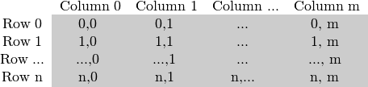

# How to Scan Images, Lookup Tables, and Time Measurements Using OpenCV

 **Let's consider a simple color reduction method. By using the unsigned char C and C++ types to store matrix entries, one pixel channel can have up to 256 different values. For a three-channel image, this can result in too many colors (16 million to be exact). **Using so many shades can seriously affect the performance of our algorithm. However, sometimes using fewer colors is enough to get the same end result.

 In such cases, we usually do a color space reduction. This means that we divide the current value of the color space by the new input value to get fewer colors. For example, each value between 0 and 9 takes the new value 0, each value between 10 and 19 takes the new value 10, and so on.

 When you divide a uchar (unsigned char - i.e. a value between 0 and 255) value by an int value, the result will also be a char. These values can only be char values. Therefore, any fractions are rounded down. Using this fact, the upper operation in the uchar domain can be expressed as:
$$
I_{new} = (I_{odd}/10)*10
$$
 A simple color space reduction algorithm simply goes through each pixel of the image matrix and applies this formula. It is worth noting that, **we performed division and multiplication operations. These operations are very expensive for the system. If possible, it is worth avoiding them by using cheaper operations such as some subtractions, additions, or in the best case, simple assignments. Also, note that we have only a limited number of input values for the upper operation. For uchar systems, 256 to be exact. **

Therefore, for larger images, it is better to calculate all possible values beforehand and use a lookup table to do the assignment during the assignment. A lookup table is a simple array (with one or more dimensions) that holds the final output value for a given input value change. Its advantage is that we do not need to do the calculation, we just need to read the result.

Our test case program (and the code sample below) will do the following: read the image passed as a command line argument (can be a color or grayscale image) and apply reduction using the given command line argument integer value. In OpenCV, there are currently three main ways to scan an image pixel by pixel.

- C array table access method
- Iterators
- Random address access

 Let's try it. The author wrote a test program based on the opencv sample code [opencv/samples/cpp/tutorial_code/core/how_to_scan_images/how_to_scan_images.cpp at 4.x · opencv/opencv (github.com)](https://github.com/opencv/opencv/blob/4.x/samples/cpp/tutorial_code/core/how_to_scan_images/how_to_scan_images.cpp). You can also watch it at my github project address:

[CCPixelCraft/develop_example/examples at main · Charliechen114514/CCPixelCraft (github.com)](https://github.com/Charliechen114514/CCPixelCraft/tree/main/develop_example/examples)

> I need to add a sentence here. The author used the opencv timing with the Opencv example. You can also use the C++ duration library to complete the timing. This is optional.
>
> - getTickCount(): used to return the number of timing cycles from the start of the operating system to the current time. The name is also easy to understand, get Tick Count(s).
> - getTickFrequency(): used to return the CPU frequency. get Tick Frequency. The unit here is seconds, that is, the number of repetitions in one second.
>
> So the rest is clear:
>
> - Total times / Number of repetitions in one second = Time(s)
> - 1000 * Total times / Number of repetitions in one second = Time(ms)

## How is the image matrix stored in memory?

The size of the matrix depends on the color system used. More precisely, it depends on the number of channels used. For grayscale images, we have something like this:



 For color images, things are a little more complicated


 Note that the order of the channels is reversed: BGR instead of RGB. Because in many cases the memory is large enough to store the rows in a contiguous manner, the rows may be arranged one after another, creating one long row. Because everything is in one place, arranged one after another, this may help speed up the scanning process. We can use the cv::Mat::isContinuous() function to ask the matrix if this is the case. Continue to the next section to find an example.

## Efficient method

 When it comes to performance, the classic C-style operator[] (pointer) access is unmatched. It is also the fastest. The results of running an equivalent test program written by the author are:

```
void scanningInIterator(cv::Mat& I, const uchar* const table) {
    // 仅接受8位无符号整型（uchar）类型的图像
    CV_Assert(I.depth() == CV_8U);

    // 获取图像的通道数（单通道图像为1，三通道图像为3等）
    const int channels = I.channels();

    // 根据通道数选择不同的处理方式
    switch (channels) {
        // 单通道图像处理（如灰度图像）
        case 1: {
            // 定义图像迭代器，遍历图像中每一个像素
            cv::MatIterator_<uchar> it, end;
            // 获取图像的起始和结束迭代器
            for (it = I.begin<uchar>(), end = I.end<uchar>(); it != end; ++it)
                // 使用查找表替换每个像素的值
                *it = table[*it];
            break;
        }
        // 三通道图像处理（如彩色图像）
        case 3: {
            // 定义图像迭代器，遍历图像中每一个像素（每个像素是一个三通道的向量）
            cv::MatIterator_<cv::Vec3b> it, end;
            // 获取图像的起始和结束迭代器
            for (it = I.begin<cv::Vec3b>(), end = I.end<cv::Vec3b>(); it != end;
                 ++it) {
                // 使用查找表分别替换每个通道的值
                (*it)[0] = table[(*it)[0]]; // 蓝色通道
                (*it)[1] = table[(*it)[1]]; // 绿色通道
                (*it)[2] = table[(*it)[2]]; // 红色通道
            }
            break;
        }
        // 不支持其他通道数的图像
        default:
            std::cerr << "Unsupported test channels." << std::endl;
            break;
    }
}
```

For color images, we have three uchar items per column. This can be considered as a short vector of uchar items, which has been named Vec3b in OpenCV. To access the nth subcolumn, we use a simple operator [] access. It is important to remember that OpenCV iterators iterate over columns and automatically skip to the next row. So for color images, if you use a simple uchar iterator, you will only be able to access the blue channel values.

## Instant address calculation and return reference

 The last method is not recommended for scanning. It is made for getting or modifying random elements in an image. Its basic usage is to specify the row and column number of the item to be accessed. In our previous scanning methods, you have noticed that it is important what type you are looking at the image through. It is the same here, as you need to manually specify what type to use when looking automatically.

```
void scanningInRandomAddress(cv::Mat& I, const uchar* const table) {
    // 仅接受8位无符号整型（uchar）类型的图像
    CV_Assert(I.depth() == CV_8U);

    // 获取图像的通道数（单通道图像为1，三通道图像为3等）
    const int channels = I.channels();

    // 根据通道数选择不同的处理方式
    switch (channels) {
        // 单通道图像处理（如灰度图像）
        case 1: {
            // 遍历图像的每个像素
            for (int i = 0; i < I.rows; ++i)
                for (int j = 0; j < I.cols; ++j)
                    // 使用查找表替换每个像素的值
                    I.at<uchar>(i, j) = table[I.at<uchar>(i, j)];
            break;
        }
        // 三通道图像处理（如彩色图像）
        case 3: {
            // 将图像数据复制到一个 Mat_<Vec3b> 对象中，方便后续处理
            cv::Mat_<cv::Vec3b> _I = I;

            // 遍历图像的每个像素
            for (int i = 0; i < I.rows; ++i)
                for (int j = 0; j < I.cols; ++j) {
                    // 使用查找表分别替换每个通道的像素值
                    _I(i, j)[0] = table[_I(i, j)[0]]; // 蓝色通道
                    _I(i, j)[1] = table[_I(i, j)[1]]; // 绿色通道
                    _I(i, j)[2] = table[_I(i, j)[2]]; // 红色通道
                }
            // 将处理后的图像重新赋值给原图像
            I = _I;
            break;
        }
        // 不支持其他通道数的图像
        default:
            std::cerr << "Unsupported test channels." << std::endl;
            break;
    }
}
```

This function takes your input type and coordinates and computes the address of the queried item. It then returns a reference to the item. This may be a constant when you get a value, and a non-constant when you set a value. As a safety step only in debug mode*, a check is performed to make sure your input coordinates are valid and actually exist. If this is not the case, you will get a nice output message on the standard error output stream. The only difference in this approach compared to the efficient approach in release mode is that for each element of the image you get a new row pointer and we use the C operator [] to get the column element.

 If you need to do multiple lookups on an image using this method, entering the type and the at keyword on each access can be cumbersome and time consuming. To solve this problem, OpenCV has a cv::Mat_ data type. It is the same as Mat, but requires you to specify at definition what data type you want to look at the data matrix through, but in return you can use the operator () to quickly access items. To make things even better, this can be easily converted from the usual cv::Mat data type to the usual cv::Mat data type. You can see an example usage of this in the color image of the above function. However, it is important to note that the same operation can be done (with the same running speed) using the cv::Mat::at function.

## Core Functions

 This is an additional method to implement lookup table modification in an image. In image processing, it is very common to modify all the values of a given image to other values. OpenCV provides a function to modify the values of an image without having to write the scanning logic of the image. We use the cv::LUT() function of the core module. First, we build a Mat type lookup table:

```
Mat lookUpTable(1, 256, CV_8U);
uchar* p = lookUpTable.ptr();
for( int i = 0; i < 256; ++i)
p[i] = table[i];
```

Finally, call the function (I is our input image, J is the output image):

```
LUT(I, lookUpTable, J);
```

The program I wrote is on github, you can go to clone it: [Charliechen114514/CCPixelCraft: A PixelLevel Image Convertor And Processor. Also Provide Opencv4 Tourial Usage... (github.com)](https://github.com/Charliechen114514/CCPixelCraft)