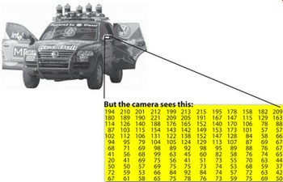
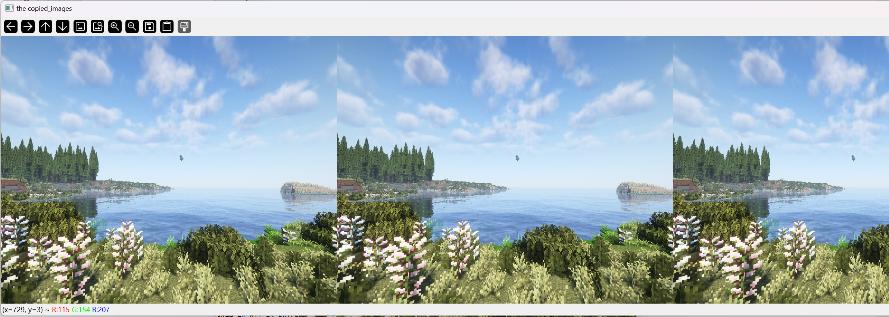
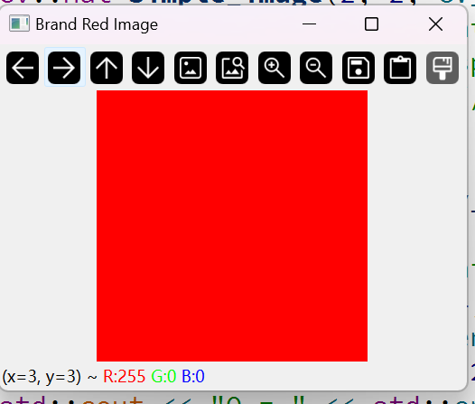

# Use of cv::Mat

 Although we can completely treat cv::Mat as a black box, the author's suggestion is to still deeply understand and learn the construction logic and storage principle of cv::Mat itself, so that when looking for problems or encountering some strange image display problems, we can quickly think of the source of the problem. This is an important purpose that the author intends to start from here

 In fact, we have many ways to obtain digital images from the real world: digital cameras, scanners, computed tomography and magnetic resonance imaging, etc. Of course, for every beginner, it is more likely to start with our camera. In each case, we (humans) see an image. However, when it is converted to our digital device, we record the value of each point in the image. In other words, we use values to store the information of the recorded image. Then when it is actually displayed, the control device is restored according to the information we stored. That's it, for example, the following



(This picture is too classic, anyone who has read "Learning Opencv3" will know this picture), what we see with our human eyes is a car, but for the computer, it is just a matrix containing all the intensity values of the pixel points. The way we obtain and store pixel values may vary depending on our needs, but ultimately all images in the computer world can be reduced to a matrix of values and other information describing the matrix itself. OpenCV is a computer vision library whose main focus is processing and manipulating this information. Therefore, the first thing you need to be familiar with is how OpenCV stores and processes images.

### Mat

 OpenCV has been around since 2001. At that time, the library was built around a C interface, and in order to store images in memory, they used a C structure called IplImage. This is what you will see in most old tutorials and educational materials. **The problem is that it brings all the shortcomings of the C language to the table. The biggest problem is manual memory management. It is built on the assumption that the user is responsible for handling memory allocation and deallocation. While this is not a problem for smaller programs, once your code base grows, it becomes much harder to handle all of these issues, rather than focusing on solving your development goals.

 Fortunately, C++ came along and introduced the concept of classes, making things easier for users by (more or less) automatically managing memory. The good news is that C++ is fully compatible with C, so there are no compatibility issues with making the change. Therefore, OpenCV 2.0 introduced a new C++ interface that provides a new way of doing things, which means you don't need to fiddle with memory management, making your code cleaner (write less, achieve more). The main downside of the C++ interface is that many embedded development systems currently only support C. So unless you are targeting an embedded platform, there is no point in using the old way (unless you are a masochist programmer and you are asking for trouble).

 The first thing you need to know about Mat is that, **you no longer need to manually allocate memory and deallocate it as soon as you don't need it. While it is still possible to do so, most OpenCV functions automatically allocate their output data. If you pass an existing Mat object that already has the required space allocated for the matrix, this will be reused, which is a nice bonus. In other words, we always use only the memory required to perform the task.

 Mat is basically a class that contains two parts of data: a matrix header (which contains information such as the size of the matrix, the method used for storage, at which address the matrix is stored, etc.) and a pointer to the matrix containing the pixel values (in any dimensions depending on the chosen storage method). The matrix header size is constant, but the size of the matrix itself can vary from image to image and is often orders of magnitude larger.

 As we know, OpenCV is an image processing library. It contains a large number of image processing functions. To solve computationally challenging problems, most of the time you end up using more than one function from the library. Therefore, passing images to functions is a common practice. We should not forget that we are talking about image processing algorithms, which tend to be computationally intensive. The last thing we want to do is to slow down the program further by making unnecessary copies of images that can be large.

 To solve this problem, OpenCV uses a reference counting system. The idea is that each Mat object has its own header, but matrices can be shared between two Mat objects by having their matrix pointers point to the same address. Furthermore, the copy operator will only copy the header and the pointer to the big matrix, not the data itself.

 We can test this out for ourselves. For example:

```
Mat A, C; // Create only the header part
A = imread(argv[1], IMREAD_COLOR); // Here we will know which method is used (allocate the matrix)
Mat B(A); // Use the copy constructor
C = A; // Assignment operator
```

 All of the above objects ultimately point to the same data matrix, and modifying any of them will affect all the other objects as well. In fact, the different objects just provide different access methods to the same underlying data. However, their header part is different. Now you might ask - if the matrix itself may belong to multiple Mat objects, then who is responsible for cleaning it up when it is no longer needed? The short answer is: the last object that uses it. This is handled by using a reference counting mechanism. Every time someone copies the header of a Mat object, a counter for the matrix is incremented. Every time the header is cleaned up, this counter is decremented. When the counter reaches zero, the matrix is deallocated. Sometimes you also want to copy the matrix itself, so OpenCV provides cv::Mat::clone() and cv::Mat::copyTo() functions.

 I wrote a verification program in the develop_example/examples/basic_usage example subroutine, you can go there and check it out. This is the display effect:



 (Oh, it's really too long)

 It is worth mentioning that if we want to completely copy a matrix:

```
Mat F = A.clone();
Mat G;
A.copyTo(G);
```

 Now modifying F or G will not affect the matrix pointed to by A's header. What you need to remember is:

- Output image allocation of OpenCV functions is automatic (unless otherwise specified).
- You don't need to think about memory management with OpenCV's C++ interface.
- The assignment operator and copy constructor only copy the header.
- The underlying matrix of an image can be copied using the cv::Mat::clone() and cv::Mat::copyTo() functions.

 The really interesting part is that you can create headers that refer to only a portion of the complete data. For example, to create a region of interest (ROI) in an image, just create a new header:

```
Mat D (A, Rect(10, 10, 100, 100) ); // Using a rectangle
Mat E = A(Range::all(), Range(1,3)); // Using row and column boundaries
```

### Storage methods

This is about how the pixel values are stored. You can choose the color space and the type of data used. The color space refers to how we combine the color components to encode a given color. The simplest is grayscale, where the colors we can deal with are black and white. These combinations allow us to create multiple shades of gray.

For colorful ways, we have more methods to choose from. Each of them breaks it down into three or four basic components that we can use in combination to create other components. The most popular is RGB, mainly because this is also how our eyes construct colors. Its basic colors are red, green, and blue. To encode the transparency of the color, a fourth element, alpha (A), is sometimes added.

However, there are many other color systems, each with its own advantages:

- RGB is the most common, because our eyes use something similar, but remember that the OpenCV standard display system composes colors using the BGR color space (the red and blue channels swap places).

- HSV and HLS break down colors into hue, saturation, and value/brightness components, which is a more natural way for us to describe colors. For example, you might ignore the last component, making your algorithm less sensitive to the lighting conditions of the input image.

- YCrCb is a popular JPEG image format.
- CIE L\*a\*b* is a perceptually uniform color space that comes in handy if you need to measure how far a given color is from another color.

 Each building component has its own valid domain. This leads to the data type used. How we store a component defines the control we have over its domain. The smallest data type is char, which means one byte or 8 bits. This may be unsigned (and therefore can store values from 0 to 255) or signed (values from -127 to +127). While in the case of three components (like RGB), this width already provides 16 million possible colors to represent, we can get finer control by using float (4 bytes = 32 bits) or double (8 bytes = 64 bits) data types for each component. However, keep in mind that increasing the size of the components will also increase the size of the entire image in memory.

 I will go into more detail about this later.

## Create an image with a specified pixel-wise format.

 You have already learned how to write a matrix to an image file using the cv::imwrite() function. (Didn't you? You skipped the 0.beginners chapter, go check it out) However, for debugging purposes, it is more convenient to see the actual values. **You can use the Mat's << operator to do this**. Note that this only applies to two-dimensional matrices. While Mat is indeed effective as an image container, it is also a general matrix class. Therefore, multi-dimensional matrices can be created and manipulated. You can create Mat objects in a variety of ways: For two-dimensional and multi-channel images, we first define their size: by the number of rows and columns. Then, we need to specify the data type used to store the elements and the number of channels for each matrix point. To do this, we build multiple definitions according to the following convention:

```
CV_[number of bits per item][signed or unsigned][type prefix]C[channel number]
```

 For example, CV_8UC3 means that we use an 8-bit long unsigned character type, and there are three such types per pixel to form three channels. There are predefined types for up to four channels. cv::Scalar is a short vector of four elements. Specifying it, you can initialize all matrix points with custom values. In this way, can you guess how our grayscale image is expressed? CV_8UC1! You can go back and flip through your digital image processing book! 0~255, you can express it by counting one byte with your fingers!

```
std::cout << "Creating a image of 2 x 2 (0, 0, 255) Image";
cv::Mat simple_image(2, 2, CV_8UC3, cv::Scalar(0, 0, 255));
std::cout << "Opencv Implement the override function of the "
<< "ofstream to display the cv::Mat\n";
std::cout << simple_image; // will not be an error!
```

 That's it, we created a simple, pure red image (always note that our dear Opencv uses BGR order to describe our image!), you can enlarge the rows and columns to display them!



 The author's display is shown above. You can play around with it! Change the value of Scalar.

 You can also use C/C++ arrays and initialize them through the constructor

```
int sz[3] = {2,2,2};
Mat L(3,sz, CV_8UC(1), Scalar::all(0));
```

 The above example shows how to create a multidimensional matrix. Specify its dimensions, then pass a pointer containing the size of each dimension, and leave the rest unchanged.

 It can even be the cv::Mat::create function:

```
M.create(4,4, CV_8UC(2));
cout << "M = "<< endl << " " << M << endl << endl;
```

 In addition, the following contents are things that you think of looking up functions. The author recommends just taking a quick look

 Mat can be initialized in the same way as using Matlab functions

```
std::cout << "Also, we can initalize the Mat as Matlab way";
cv::Mat E = cv::Mat::eye(4, 4, CV_64F);
std::cout << "E = " << std::endl << " " << E << std::endl << std::endl;
cv::Mat O = cv::Mat::ones(2, 2, CV_32F);
std::cout << "O = " << std::endl << " " << O << std::endl << std::endl;
cv::Mat Z = cv::Mat::zeros(3, 3, CV_8UC1);
std::cout << "Z = " << std::endl << " " << Z << std::endl << std::endl;
```

 opencv also provides other data types, such as Point2D, Point3D. The good news is that they all implement their own printing functions.

``` 
    cv::Point2f     pt(0, 0);
    cv::Point3f     pt3(0, 0, 0);
    cv::Size        sz(10, 10);
    cv::Rect        rect(0, 0, 100, 100);
    cv::Scalar      color(255, 0, 0);
    cv::Range       range(0, 10);
    cv::Vec<int, 3> vec(0, 0, 0);
    cv::Vec3b       vec3b(0, 0, 0);
    cv::Vec3f       vec3f(0, 0, 0);
    cv::Vec3d       vec3d(0, 0, 0);

    // you can display them
    std::cout << "pt = " << pt << std::endl;
    std::cout << "pt3 = " << pt3 << std::endl;
    std::cout << "sz = " << sz << std::endl;
    std::cout << "rect = " << rect << std::endl;
    std::cout << "color = " << color << std::endl;
    std::cout << "range = " << range << std::endl;
    std::cout << "vec = " << vec << std::endl;
    std::cout << "vec3b = " << vec3b << std::endl;
    std::cout << "vec3f = " << vec3f << std::endl;
    std::cout << "vec3d = " << vec3d << std::endl;
```

 Of course, you can refer to

```
opencv/samples/cpp/tutorial_code/core/mat_the_basic_image_container/mat_the_basic_image_container.cpp
```

 for further study.